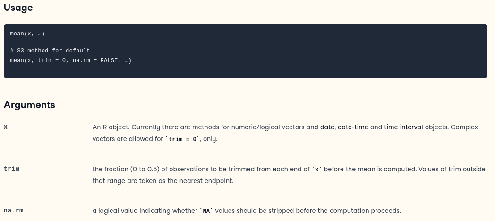

```{r, child="_Global-Options.Rmd"}
```
***
***
## Download R
1. R. The R Project for Statistical Computing. Available at: <https://cran.r-project.org/>  
Select: "Download R for (Linux/macOS/Windows)" and follow the instructions.

2. R Studio Desktop. Available at: <https://posit.co/download/rstudio-desktop/>  
Scroll down to find your installer, ex: "RSTUDIO-2024.04.2-764.EXE" for Windows

***

## Starting R
Once you have installed both R and RStudio, you will be able to start the RStudio application. The console, where you can begin to execute commands, is in the bottom left containing the `> `  
  
Recommended Reading: The R Book, Chapter 2 "Essentials of the R Language"  
Available [here](https://onlinelibrary-wiley-com.proxy1.lib.uwo.ca/doi/epdf/10.1002/9781118448908.ch2)

***

## Keeping Your Code Clean
It is important when sharing your code and for your own sanity to document your code well. R will skip any line of code that begins with a '#'

```{r}
x = 5
# x = 4
x
x = 4
x
```

***
## R as a Calculator
The basic operations are "*, +, -, /, ^"

```{r}
2+3 
2*3 
2/3 
2^3
2*(3+1)^2
```

***
## Variables
You can store results in variables and use them in calculations. You can print the value of a variable by using it as a command.

```{r}
x = 2+3

x

y = 1+2
x*y

z = x^y
z
```

R has another notation for assignment: the arrow: `<-` . Many R programmers use this. It may seem odd to programmers coming from other languages.
```{r}
x <- 3
x

x <- 5.412
x
```
>Look [here](https://statisticsglobe.com/assignment-operators-in-r) for an explanation of the differences between `=` and `<-`.

### Variable Types  
**Character:** free text, a.k.a. string\
**Factor:** Categorical values; actual values may be text (North/South/East/West) or numbers (1/2/3/4)\
**Logical:** Binary (TRUE/FALSE)\
**Integer:** Only whole numbers (1L/2L/3L/4L, the letter 'L' declares these as Integers)\
**Numeric:** Decimal Numbers (1.5/2.5/3.5/4.5)  

We can change between variable types easily in R. Sometimes when importing data, you will import unexpected datatypes. For example, you may find a column has been imported as a character instead of a number.
```{r, error=TRUE}
#
temp_char = "3" #Initialize as character
temp_char*2 #Returns an error
```
```{r}
temp_char = "3"
temp_char = as.integer(temp_char)
temp_char*2
```

Be careful if you convert a numeric variable into an integer, you will lose any data following the decimal place.
```{r}
temp_numeric = 3.14
as.integer(temp_numeric) #Only prints 3
```

If you are working with whole numbers, it is a good habit to store variables as integers. This will save space and computation time, especially in large datasets.

Example comparing the size of one million integers and one million numerics. Variable `x` is twice the size as a numeric despite containing the same information as `y`.
```{r}
x = rep(as.numeric(1), 1e7)
y = rep(as.integer(1), 1e7)

object.size(x)/object.size(y)
```

> Note: we learn more about functions later.

***
## Vectors
A vector stores a collection of any datatype.
You create vectors by using the c() function (concatenate).
```{r}
# A vector with 4 entries
c(1, 2, 3, 4)

x = c(1.1, 0.0, 3.14, 2.718)
x
```

One way to access specific values within a vector is use the index of that value: 
```{r}
x[1]
x[4]
```

Or you can access a range of values:
```{r}
x[2:4]
```


Sequences of integers are so common that there is a shortcut for making them.
```{r}
1:4
9:2
# or 
seq(1,2,0.1)
```

A long vector will be displayed over several lines. The number at the start of each line in brackets is the index of the first entry on that line.
```{r}
x = 1:40
x
```

***
## Matrices, Arrays, Data Frames
### Matrices
A matrix is a two dimensional set of data.

You can specify matrices of any size. The `nrow` parameter tells R the number of rows, and `ncol` tells R the number of columns.
```{r}
myMatrix = matrix(data = 0, nrow = 3, ncol = 2)
```

Like in a vector we can access matrix items using square brackets, however we now require two inputs, one for each dimension.
```{r}
myMatrix
myMatrix[1,1] = 2
myMatrix[1,2] = 3
myMatrix
```

We can also access entire rows or columns of matrices at once, by leaving the input blank.
```{r}
myMatrix[1, ]
myMatrix[ , 1]
```

We can add rows or columns using the `rbind()` and `cbind()` functions.
```{r}
my2ndMatrix = cbind(myMatrix,c(1,2,3))
my2ndMatrix
my2ndMatrix = rbind(myMatrix, c(1,2))
my2ndMatrix
```

Useful operators on matrices:
```{r}
#Dimensions
dim(myMatrix)
nrow(myMatrix) #Display the number of rows
ncol(myMatrix) #Display the number of columns
length(myMatrix)
#Check if item exists
1 %in% myMatrix
2 %in% myMatrix
```

### Arrays
Arrays are very similar to matrices. The key difference is they can have more than two dimensions.

```{r}
# Creating a 4x3x2 array
myArray = array(data = 0, dim = c(4,3,2))
myArray[1,1,1] = 1
myArray[1,2,1] = 2
myArray[1,1,2] = 3
myArray[1,2,2] = 4
myArray[2, , ] = 5
myArray
```
### Data Frames
Data frames are more complex matrices. They allow for each column to contain a different data type. Some statistics functions will require either a data frame or a matrix.

The data you will be using in this class will be imported as data frames.

You can use the same functions and methods of accessing data frames as you can matrices, with the addition of some new ones.
```{r}
myDF = data.frame(col1 = 1:3, col2 = 4:6, col3 = c("a", "b", "c"))
myDF
#Request a summary of the data frame
summary(myDF)
#Access specific named columns
myDF$col1
myDF$col3
```
```{r, include=FALSE, eval=FALSE}
***
## Data Tables
data.tables are hype

```

***
## Functions
R has all the functions you know and love. (Most of them can be used on vectors.)
```{r}
sin(1)
sin(1.4)
sin(3)

# R knows about pi
pi

sin(pi/2)

# The exponential function
exp(0)
exp(1)

# factorial:  n!
factorial(8)

# n choose k 
factorial(8)/(factorial(3)*factorial(8-3))

# a built in function!
choose(8,3)
```

Sum and mean functions on vectors. They take the sum and average respectively of the vectors entries
```{r}
x = 1:6
x

sum(x)

mean(x)
```

Example: find the sum of the integers from 1 to 1024.
```{r}
x = 1:1024
sum(x)

# This can be done in one command.
sum(1:1024)
```

Functions can have required and optional variables that must be passed through.
For example, the function 'mean' is described this way:

If the data in the vector Y includes NA the default mean function doesn’t work properly.
```{r}
Y <- c(1, 2, 3, NA, 5, 6, NA, 9, 10, NA)
mean(Y)

# Same as the default
mean(Y, na.rm=FALSE)     

# Changing the argument to TRUE
mean(Y, na.rm=TRUE)
```

### Custom Functions
When writing code, you will often find that you are using the same lines of code more than once. In these cases it can help readability and usability to create your own function for repeat lines of code.  

Below is a simple function showcasing the ability to use custom inputs and return a value after applying some transformations.
```{r}
someFunction = function(input1, input2){
  output = (input1 + input2) * 5
  
  #A return statement is needed to tell your function what value to send back
  return(output)
}
```

With your custom function in memory, you may now call upon it whenever you like.
```{r}
someFunction(1,2)
someFunction(5,10)
```

***
## If Statements and Loops  
### Logical Conditions  
R supports logical conditions:  

| Operator | Name           | Example |  
|:----------:|---------------|:---------:|   
| ==      | Equal                     | x == y |  
| !=      | Not equal                 | x != y |  
| >      | Greater than              | x > y |  
| <       | Less than                 | x < y |  
| >=     | Greater than or equal to | x >= y |  
| <=      | Less than or equal to     | x <= y |  

It is important to distinguish between a single `=` and two `==`. One is assignment, two is logical comparison.
```{r}
1==1
1==0
1>0
```

### If Statements
We can use logical conditions in many ways, the most common is within `if` statements. An `if` statement only executes if its condition is TRUE
```{r}
x = 1
if(1==1) {
  x = 2
}
x
if(1==0) {
  x = 3
}
x
```

We can also provide code that will run should the `if` statement be FALSE.
```{r}
x = 1
if(1==0){ 
  x = 2 #IF TRUE 
} else {
  x = 3 #IF FALSE
}
x
```

We can add multiple conditions.
```{r}
x = 1
if(1==0){ 
  x = 2 #Check one first
} else if(1==1){
  x = 3 #Check two second
}else{ 
  x = 4 #If neither is TRUE
}
x
```

### Logical Operators
R supports logical operators as well:  

| Operator | Description           | 
|:----------:|---------------|   
| &&      | Logical AND operator - Returns TRUE if both statements are TRUE |
| \|\|      | Logical OR operator. It returns TRUE if one of the statements is TRUE.| 
| !      | Logical NOT - returns FALSE if statement is TRUE |  

```{r}
1||0
1&&0
!1||0
```

### Loops
There are two types of loops in R.  

* __While__ loops  
* __For__ loops  

#### While
While loops execute as long as a condition remains TRUE.
```{r}
x = 1
while(x < 5){
  print(x)
  x = x + 1
}
```
It is important to be careful with loops. For example, forgetting to increment x can cause an infinite loop.  

#### For
For loops allow for iterating over a sequence. The `for` statement will execute code once for each item.
```{r}
for(x in 1:5){
  print(x)
}
```

#### Break and Next
The `break` and `next` statements allow for more control within our loops. `Break` will stop our loop, and `next` will skip the current iteration without stopping the remainder.
```{r}
for(x in 1:5){
  if(x==4) break
  print(x)
}
for(x in 1:5){
  if(x==4) next
  print(x)
}
```

#### More complex example
```{r}
data = read.csv("Datasets/families.csv")
head(data)

#Count number of families with more than two people
count = 0
for(x in 1:nrow(data)){
  if(data[x, "PERSONS"]>2) count = count + 1
}
count
```


## Getting Help
R and RStudio have complete documentation on all R functions. The lower right pane in RStudio has a help tab you can use. The help contains a lot of information, so you will have to learn to filter out what you don't need. Try to use the R Documentation before taking your query to your favourite search engine.
```{r, eval=FALSE}
# You can also access the help directly from the console tab. This will open the R Documentation for the 'mean()' function.
help(mean)
# or
?mean
```
